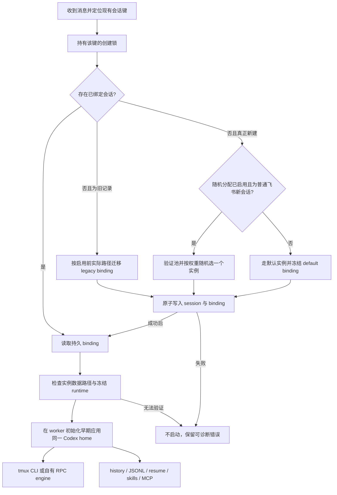

# 同一机器人内的会话级 Codex 实例选择

状态：实现完成，本地回归、双真实账号及飞书新话题/续聊验收通过（见 [验收记录](session-cli-instances-acceptance.md)）。以下保留设计阶段的依据与验收要求；当前配置/命令以 [使用文档](../codex-instances.md) 为准。已在获准的 macOS 本机 Bot 部署，Linux 实机未验证。

调研基准：`origin/master`，`0aba0fdddb9547b9e983bb9ae8147dceb8e1abbb`（2026-09-08 拉取）。本方案基于该提交，不表示已安装的旧版本具备下面的能力。

## 1. 目标与边界

同一个飞书应用收到一个普通飞书对话来源的真正新会话时，从管理员预先配置、完成登录的 Codex 实例中按配置权重随机选择一个；权重默认均为 1，即均匀随机。先持久化绑定，再启动 worker。后续消息、重试、休眠恢复、daemon/机器重启沿用原绑定。多个会话可以选中同一个实例；无需安装多份 Codex 二进制。v1 分配 scope 固定为 `ordinary-feishu`；定时任务、HTTP、其他 IM、workflow 等来源不参与随机，保留创建流程，其默认 Codex 新会话使用显式默认实例。不能因为启用池而关闭这些既有功能。

v1 建议仅支持 `cliId=codex`、本机受管 `tmux` 后端、`sandbox=false` / `readIsolation=false`、无 `wrapperCli`，先覆盖最常见的现有部署。共用 bot 的 runtime、模型和工作目录规则，每个实例仅有独立 Codex 数据目录和登录状态。不声称支持 Codex/Claude/TraeX 混合随机，也不新增通用 runner 框架。实例绑定的数据形状保留 `cliId`，便于以后扩展，但配置校验在 v1 拒绝其他组合。

保证的是 **instance/home/runtime 路由绑定**。同一目录被人工换号后，不能仅凭目录证明仍是原账号；v1 不宣称永久 account pinning。禁止以同一实例 ID/目录代表另一个账号，正常 token 刷新可继续。若需要强账号一致性，后续必须验证 Codex 可提供的非敏感账号标识及其稳定性，单独实现身份变更检测；不得把 token、token hash 或凭据副本写入 session/log。

不做自动登录、额度探测/聚合、额度不足后的账号轮换、跨实例会话拷贝、账号共享策略、按实时负载自动调整权重、租约容量、批量换号或 OS 用户隔离。v1 仅支持管理员配置的静态分配权重。旧会话和现有 bot 权限不随启用实例池而改变。

## 2. 已有实现与真正的缺口

下表路径/行号均对应上面的固定基准。

| 现有能力 | 证据 | 对方案的影响 |
| --- | --- | --- |
| Session 区分 thread/chat，保存路由锚点 | `src/types.ts:264-284` | 按 Botmux 现有会话键分配，不按每条消息或发送人分配 |
| `cliId`、`cliRuntime`、wrapper 已冻结；`cliLaunchSnapshot` 支持 `/cli` 选择 | `src/types.ts:673-712,837-852`；`src/core/worker-pool.ts:1569-1709` | 复用 runtime 快照，不把账号身份塞进 runtime ID |
| `/cli` 拒绝 bot env/Riff 等组合，init 会丢弃 bot env | `src/core/worker-pool.ts:1573-1580,10789-10792` | 不能用 `/cli` entry + `env.CODEX_HOME` 冒充实例支持 |
| bot config 变化仍可能触发 CLI/runtime mismatch 清理，显式 `/cli` 是豁免路径 | `src/core/session-manager.ts:282-331` | 新绑定会话也须按自身冻结身份判断，不能因池编辑被误关 |
| `codexAuthSync` 默认 shared，init 从当前 bot 配置读取 | `src/bot-registry.ts:3482`；`src/core/worker-pool.ts:10781` | 仅冻结 runtime 不够；home 和有效 auth 策略也必须冻结 |
| isolated 使用 `<BOT_HOME>/codex`；shared 可复制全局 auth | `src/services/codex-auth-sync.ts:28-118` | 目前隔离粒度是 bot，必须增加明确实例 home 路径 |
| worker 早期重定向自身 `CODEX_HOME`，CLI child 后期注入同目录 | `src/worker.ts:13460-13550,14715-14738` | worker/CLI 都必须收到同一解析结果，不能只改 shell wrapper |
| Codex history/session 根是动态读取进程环境 | `src/services/codex-paths.ts:10-22` | 专属 worker 可以用 process.env；daemon 多会话路径查询必须显式传根 |
| RPC engine 从 worker env 建立，随后合并 bot env、冻结 owner | `src/worker.ts:1239-1269` | home 应在 RPC engagement 之前解析，不能等 spawnCli 才设置 |
| skillsDir 动态读取 Codex home | `src/adapters/cli/codex.ts:460-465` | skills 安装、MCP 配置和 transcript 查找都要跟随实例 |
| session store 的拥有者只写 SQLite；兼容 JSON 是旧版本读取/一次性导入格式；基准 create/update 先修改 cache 再 persist | `src/services/session-store.ts:1631-1653,2193-2197` | 不恢复已删除的 JSON 写引擎；实例更新需提交后发布 cache |
| 已有会话键锁与初次启动栅栏 | `src/core/session-manager.ts:3113,3660,4109` | 复用已有并发约束，但审计全部创建入口是否经过它 |
| fork 复制 runtime 和 launch snapshot | `src/core/worker-pool.ts:8586-8669` | 同时复制 instance binding，不能让 fork 重新抽签 |
| adopt 单独构造 init，连接已存在进程 | `src/core/worker-pool.ts:15319-15380` | 不能给外部进程随意指定新 home；v1 外部 adopt 不参与分配 |

现有 `provisionIsolatedBotHome` 还会一次性复制全局 `config.toml`，且捕获 provisioning 错误后只写 WARN（`src/worker.ts:1758-1770`）。实例初始化不能直接沿用这个容错：验证失败应阻止启动，也不能隐式复制可能携带 provider/身份配置的全局配置。



## 3. 配置结构

放在该 bot 的配置中，不建立第二套全局账号注册表。

```json
{
  "cliId": "codex",
  "backendType": "tmux",
  "codexInstancePool": {
    "enabled": true,
    "defaultInstanceId": "a",
    "scope": "ordinary-feishu",
    "strategy": "random",
    "instances": [
      { "id": "a", "codexHome": "/data/codex-accounts/a", "enabled": true, "weight": 3 },
      { "id": "b", "codexHome": "/data/codex-accounts/b", "enabled": true, "weight": 1 }
    ]
  }
}
```

- `id` 为 bot 内唯一且稳定的管理员标识，只允许安全单段字符；不可改名、复用旧 ID 表示另一个身份。`enabled` 默认 true，策略 v1 仅支持 random。`scope` 必填且 v1 仅允许 `ordinary-feishu`，配置与状态页面明确显示“仅普通飞书新会话参与随机分配”。
- 顶层 `cliId=codex` 选择程序，原有 runtime/执行路径/模型配置继续共用，并不选择账号。只要配置了实例池对象，`defaultInstanceId` 就必填且必须引用其中一个实例（整个池 `enabled=false` 时也一样）；默认路由的新 Codex 会话明确使用该实例，不再隐式使用全局账号。上例默认实例为 a。没有实例池对象的旧配置保持现有行为；已有会话不重新绑定默认实例。
- `weight` 可选，省略时为 1；仅接受正安全整数，拒绝 0、负数、小数、字符串和非有限数，并校验候选总权重不超过安全整数范围。暂停新分配统一用 `enabled=false`，不另设零权重状态。`random` 按有效候选的权重比例抽样：上例两个实例均可用时概率为 75% / 25%；全部省略或权重相同时为均匀随机，无需另切策略。
- 每个实例必须显式配置 `codexHome`，ID 到目录的映射只维护在该 bot 的 `instances` 配置中，不再从 ID 或 BOT_HOME 推导。路径必须是运行 Botmux 的机器上的绝对目录，不接受相对路径、`~`、环境变量展开或缺省回退；示例 `/data/codex-accounts/a` 仅为示意，不表示机器上已存在。v1 仍不开放任意 env 或 per-instance executable。
- 登录前允许通过显式初始化入口创建尚不存在的目录；启动前目录必须已经存在，并校验目录类型、realpath、所有者及私有权限，禁止 leaf symlink/hardlink 凭据绕行，沿用 secure-host-file 的权限检查。同一 bot 的不同实例不能指向同一个规范目录；拒绝嵌套 home，避免把一个实例的数据根包含在另一个中。检查输出同时显示配置路径与解析后的规范路径。
- 同一 bot 的实例共用其冻结 runtime。会话创建时将所选实例的规范绝对 home 写入绑定；后续改 `codexHome` 只影响新建会话，旧记录仍使用冻结路径，不通过当前 ID 映射重新定位。路径修改不是数据迁移，不自动移动、复制或删除目录；同一 ID 仍不得换成另一个账号，受控迁移需另行处理。
- 池实例强制采用文件凭据存储及 isolated auth 语义。管理员预先在该 home 登录并准备所需 config/skills；不自动复制全局 auth/config，不更改现有全局 home。凭据存储选项需以实际安装 CLI 的帮助/配置 schema 验证后实现。
- bot 原有 `codexAuthSync` 继续仅服务 legacy 及未配置实例池的原有路径，不能覆盖显式实例 binding 的 isolated 策略，包括通过 `defaultInstanceId` 选择的实例。`env` 中 home、身份、provider auth 覆盖项在配置实例池时拒绝；v1 最小方案可直接拒绝所有非空 bot env（与现有 `/cli` 限制一致），错误应明确。
- 配置 loader、Dashboard/CLI 写入口统一复用验证器。v1 可先提供配置文件 + 检查命令，不必制作多账号登录 UI。未知组合必须报错，不能忽略后退到全局账号。

`codexInstancePool.enabled=false` 表示关闭随机分配，不关闭默认实例路由：新建 Codex 会话改用 `defaultInstanceId` 并冻结 default binding；旧会话继续。实例 `enabled=false` 仅表示退出随机候选，仍允许已绑定会话以及显式默认路由使用，检查输出必须分别显示“参与随机”和“默认实例”，避免误认为已撤销账号。池启用但随机候选为空时，范围内新建失败，不能 fallback 默认实例或全局。默认实例本身未登录/不可用时，默认路由报错，也不能自动换号。

上面的随机池错误行为只作用于分配 scope 内的新建。范围外来源保留原有创建流程，但配置实例池后的默认 Codex 新会话使用 `defaultInstanceId` 并冻结 default binding；已有会话保留 legacy/binding，显式其他 CLI 仍使用其现有冻结机制。随机候选不可用不能阻止正常的默认实例启动。这是明确的默认路由，不是抽签或启动失败后的 fallback。启用前 preflight 必须提示定时任务等默认 Codex 新会话将使用哪个实例；不把已有任务会话迁走。

### 3.1 ID、目录和账号如何关联

关联直接维护在机器人配置里：按 `instances[].id` 查找对应的 `codexHome`，再由统一解析器校验并转换为规范绝对路径。登录、检查和新会话选择复用这个解析器；旧会话恢复读取持久 binding 中的 home，不重新查当前映射。实现时需在 Botmux 配置 schema、配置文档和管理入口中同时说明这一规则；当前它仍是拟新增能力，不是既有官方配置。`codexHome` 是 Codex 的数据/登录目录，不是代码仓库或 CLI 工作目录，也不替换 Botmux 自身的 BOT_HOME。实际账号来自该 home 中的登录状态，不能从 ID 或目录名推断身份。

| 配置 ID | 显式配置的 codexHome | 管理员操作 |
| --- | --- | --- |
| `a` | `/data/codex-accounts/a` | 检查此目录已有登录，或在此 home 的登录流程中选择账号 A |
| `b` | `/data/codex-accounts/b` | 检查此目录已有登录，或在此 home 的登录流程中选择账号 B |

计划提供按 bot + instance ID 操作的初始化、登录和检查入口（具体命令语法在实现阶段确定，当前不可执行）：

1. 先从配置读取并显示 codexHome；尚不存在时，只有用户显式发起初始化才以私有权限创建目录及最小独立配置。目录已存在则只检查兼容性、权限及文件凭据模式；不得覆盖已有内容或复制全局 auth，普通配置加载和启动不得隐式创建空目录。
2. 用户主动发起登录时，管理入口只为此次 Codex 登录子进程设置该实例的 `CODEX_HOME`，用户手动选择对应账号。不更改 shell、daemon 或 tmux server 的全局环境，也不静默在已有实例中换号。
3. 检查入口与新会话启动使用同一目录解析器，展示 ID、配置路径、规范路径、是否默认、随机权重和该 home 的实际登录状态；已有会话单独展示冻结 home，配置已改路径时明确提示差异。管理员视图仅在 CLI 有受支持、经过验证的身份查询能力时展示脱敏账号标识；否则明确显示“账号身份未验证”，不能凭实例 ID 宣称是账号 A，也不得输出 token 或完整凭据文件。
4. 配置 `defaultInstanceId=a` 后，默认路由和选中 a 的随机路由都使用上述同一个目录；实际会话中保存 ID 和规范 home，后续直接按绑定恢复。

已有 A/B 目录可以直接把各自的绝对路径填入 `codexHome`；通过权限、配置和登录模式检查后即可用于新会话，无需为了符合命名规则移动目录或重新登录。若旧目录依赖共享 keychain、继承的 API 凭据等不符合实例隔离要求，应明确报告并由用户选择处理方式，不能宣称填路径就完成账号隔离。引用已有目录不等于自动导入其中的历史会话，也不迁移 Botmux 旧绑定；需要数据迁移时另行授权。这里只规划管理流程，本次不执行登录、目录创建或迁移。

## 4. 持久化模型及选择时机

新增独立的 `Session.cliInstanceBinding`，避免污染 `/cli` launch selection 与 runtime 的既有语义。

```ts
// Session.cliRuntime 继续是唯一 runtime 快照。
type SessionCliInstanceBindingV1 = {
  version: 1;
  source: 'pool' | 'legacy' | 'default';
  instanceId: string | null; // pool/default 必须为实例 ID；legacy 才为 null，绝不表示待随机
  cliId: 'codex';
  codexHome: string;         // 宿主规范绝对路径，非凭据
  authMode: 'isolated' | 'shared' | 'global';
};
```

`source=pool` 表示加权选中，`source=default` 表示由 `defaultInstanceId` 选中，两者均保存非空实例 ID 并强制 isolated auth；`source=legacy` 表示旧路径，ID 为 null。未配置实例池的旧配置不强制新增绑定；若因兼容迁移记录其原路径，也使用 legacy，不把 null 当成显式默认实例。

实例 binding 必须与现有 `Session.cliId/cliRuntime/cliPathOverride/agentFrozen` 在同一个 row 写入。runtime 字段保持现有语义：冻结分发身份和执行路径，不冻结磁盘二进制内容或版本；正常更新同路径可继续。`cliSessionId` 仍在 CLI 建立实际会话后保存，不凭空生成。

新建入口必须显式传 creation intent，不能用“binding 缺失”或 `agentFrozen=false` 判定新会话。已存在但尚未运行的 pending/queued 老记录也按 legacy 迁移，避免重启时被随机改身份。

启用前提：全部新建入口必须由可信 daemon 编排层传入明确 creation source，并持久化其分配 scope 决策。不能根据 `om_` 锚点、`chatType`、是否有飞书输出或用户可控字段推断来源，因为定时任务/workflow 也可能创建飞书话题。代码上尚未可靠贯通这些来源标记时，应阻止启用新池功能并报告缺口，继续现有无池行为；不能用拒绝定时任务代替来源判定。后续消息的来源变化不重新选择实例。

store 创建接口在可信入口提供 creation intent 后原子插入完整 row；普通飞书的创建与后续消息共用 delivery FIFO，重新检查 incumbent 后才抽签。旧空壳 row 的迁移在 SQLite BEGIN IMMEDIATE 中读取并批量提交；全 row 更新使用 compare-and-set 保护陈旧写入。旧 JSON 只作为一次性导入格式验证，不新增 JSON 写引擎或路由 sidecar。

当前 `updateSession` 是全 row 写入，需保证所有写路径不把陈旧的无 binding 对象覆盖回来：新字段不可变保护放在 store 层，并采用 commit 后 cache 替换；参考已有 `persistActiveRemoteLineageExact` 的先校验 durable row 再更新思路（`src/services/session-store.ts:2203` 起）。只加内存 mutex 不能解决提交失败或离线写入竞争。

持久性需区分进程崩溃与突然掉电：当前 SQLite 使用 WAL + `synchronous=NORMAL`，旧 JSON 是无 fsync 的 tmp+rename（`src/services/session-store.ts:182-192`）。原子 row 并不等于断电后必然存在。v1 首先保证成功提交后的进程崩溃及正常系统重启；若验收要求包括突然掉电，必须在 binding publication 上提供经过验证的持久写屏障（SQLite 同步策略、JSON 文件及父目录 fsync），或者在无法证明绑定仍在时隔离遗留 pane，绝不能无证据重新随机。不能把现有存储语义包装成更强保证。

使用可注入 RNG 做加权随机选取：从一次一致的配置快照中取通过本地预检且 enabled 的候选，计算总权重 W，以 `[0, 1)` 随机值乘 W，按累积权重的左闭右开区间选中一个。实例 i 的概率为 `weight_i / W`；不要求小样本严格符合比例，不按活跃会话数或剩余额度自动改权重。候选检查仅含 enabled、目录/配置/凭据结构、可解析 runtime；文件存在不代表远端登录一定有效。抽取后启动失败，保留绑定并提示原因；重试同一实例。不能遍历账号直至某个请求成功。所有候选本地预检失败时显示汇总的非敏感错误，无新 CLI 被启动。

## 5. 旧会话迁移与完整生命周期

| 场景 | 规定行为 |
| --- | --- |
| 启用池前已有 Codex 全局会话 | 冻结 legacy/global home；绝不抽签 |
| 移除池后再修改 Bot 默认 CLI | legacy 也保留冻结 runtime/home，与 pool/default 一样豁免默认 CLI mismatch 清理；移除配置不解绑、不撤权。需显式关闭后真正新建，才采用新的默认 CLI；未绑定会话保留原 mismatch-close 行为 |
| 已有 isolated 或 sandbox 重定向会话 | 保留原 `<BOT_HOME>/codex` 及原策略；不能改为实例目录 |
| 老记录缺乏 home 证据 | 启用池前按当前有效旧逻辑做 preflight/migration；持久 pane/元数据有冲突则列为未解决，阻止启用，不猜路径 |
| 普通飞书来源的新话题/新 chat-scope 会话 | 一次选择；同一发送者开多个话题可以选到不同实例 |
| 重复事件/并发第一条消息 | 同一现有 routing key 只创建一个 session、一份 binding、一个 initial-start owner |
| 队列、工作目录选择、延后启动 | 建立 session 时冻结；排队期间池变化不触发重选 |
| worker/CLI 崩溃、suspend、冷恢复 | 读原 binding；无法读取 home/恢复记录就报错，不跨 home 查找或创建假恢复 |
| daemon 重启且 tmux CLI 仍活着 | 必须验证持久 pane 的 binding 标记匹配 instance/home/runtime；环境不一致不直接 attach，不自动杀掉正在执行的会话，暂停该恢复并明确报告 |
| 机器重启、tmux 消失 | 以原 binding 冷恢复；记录对应 transcript 缺失时，不把普通 resume-fallback 当成允许随机或清空上下文 |
| 同实例多会话并发 | 允许，沿用原生 Codex 并发语义；测试 history 同文消息串线/SQLite/凭据刷新，不增加跨实例复制 |
| fork 原生上下文 | 子会话复制父 binding/runtime，CLI fork ID 独立；明确“空白新话题”才重新选择 |
| 外部 adopt/import、现有 app-server attachment | v1 不接受 pool binding 或随机分配；维持既有流程，未知 home 不能贴上实例标签；受管会话的正常 restore 不等同外部 adopt |
| `/cli` 与显式切换 | v1 池启用的新会话不再提供第二次 `/cli` 选择；已绑定会话拒绝原地切换。既有 `/cli` 会话不受影响且不能被池回填 |
| 定时任务/HTTP/其他 IM/workflow | 已绑定会话继续复用；原有创建流程不变，配置实例池后的默认 Codex 新建使用 defaultInstanceId 并冻结 default binding，其他 CLI 保持既有机制；不参与随机池，状态明确显示默认实例与 scope 外来源。随机候选不可用不阻断正常的默认实例 |
| 关闭会话后重开 | 恢复旧 session ID 沿用绑定；真正新建 session ID 才参与分配 |

迁移在首次启用实例路由之前完成并读回（包括配置池对象但关闭随机分配的情形），包含 closed 但仍可恢复的旧记录；无法一次可靠推导的记录保留显式 legacy 未解决状态并禁止启动，不默认为候选池。无 pool 的普通升级默认保持旧行为，不能全机自动改写所有 CLI 配置。

## 6. worker、读取路径及身份边界

新增一个解析器从 durable binding + frozen runtime 生成 effective launch context；在所有 worker init 类型中明确传递绑定，不从可配置 env 或飞书消息读取 instanceId/home。worker 校验后，必须在适配器路径访问、skills/MCP 初始化、resume preflight 和 RPC engine engagement 之前应用 `CODEX_HOME`。

1. 先清理继承的 CLI home，再设置已验证 binding。worker 自身 `process.env.CODEX_HOME`、CLI child env、RPC engine env 三者必须一致。最后的 bot/adapter env 合并不能覆盖它。
2. tmux passthrough/unset 继续走 `BOTMUX_INJECTED_ENV_KEYS`（现有已含 `CODEX_HOME`，`src/utils/child-env.ts:457`）；持久 pane 标记携带非敏感 binding identity 并在 attach 时校验。不要修改 tmux server 全局环境影响其他会话。
3. auth provisioning 对 pool/default 实例只做 isolated 验证，不读/拷贝 global auth；配置初始化从独立实例配置读取。保留 bot 自身 BOT_HOME 的 send credential、schedule 等用途，不能整体把 BOT_HOME 换成实例目录。
4. worker 内动态 Codex path getter 可继续使用；daemon 内的 restore/import/cost/dashboard transcript 查询须带会话的 explicit home，禁止临时改 daemon 的 `process.env.CODEX_HOME`。同实例下的 history 匹配仍须校验 CLI session ID，跨实例搜索禁止。
5. skills/config/MCP 读写定位实例 home。bot 级 skill policy 与可信 send/owner 身份保持原逻辑，初始化写入用已有锁或原子机制防止两个新 session 同时覆盖配置；不自动同步完整全局 Codex 目录。
6. 飞书 owner 与 Codex 实例为两个独立身份：继续用 `applySessionOwnerEnv` 在配置合并后冻结 owner（`src/worker.ts:1268,14665`）。选择实例不新增 `allowedUsers` 权限，不把实例 ID 当作飞书用户。
7. 同一 OS 用户且 sandbox 关闭时，各实例文件仍可互相读取。这是登录/路由隔离，不是访问控制隔离。v1 拒绝对池开启 sandbox/readIsolation；未来支持时必须按冻结 codexHome 精确配置挂载与写权限，不能把其父目录或其他实例的数据目录一并暴露。

模型继续遵守现有 `resolveSessionLaunchModel`（bot 同 CLI 默认可更新）；不借本需求重新冻结模型。身份/runtime 冻结与模型选择分开，避免破坏现有 `/model` 和 restart 行为。

## 7. 配置变更、故障与可观测性

- 实例 enabled 只控制新会话的随机候选资格，显式默认路由与已有会话继续。v1 不增加“撤销实例立即杀全部会话”的新机制，要停止具体会话使用现有管理流程。
- 修改 defaultInstanceId 只影响配置生效后新建的默认路由会话，已有、排队、恢复和 fork 会话均保留绑定；不能删除仍被 defaultInstanceId 引用的实例。默认实例失效时报错，禁止静默选择另一个实例或全局账号。
- 修改权重仅影响配置生效后的新分配；已有、排队、恢复和 fork 会话不重选、不迁移。binding 保存选中的实例，不需要靠当前权重重建选择；配置/检查输出显示各实例有效权重。
- 删除仍有任何可恢复 session 引用的实例定义时拒绝并列出引用数量；移除整个池配置同样受保护，建议仅 `enabled=false`。closed 不自动等于可删；必须确认会话不可恢复/归档后才能删除定义，删除定义不删除数据。
- 修改 codexHome 或 runtime 配置不影响已有快照，排队、恢复和 fork 也保留原路径；管理入口提示仍引用旧目录的会话数量，不能因此清理旧目录。旧路径缺失时停止恢复，不通过当前 ID 配置重新定位另一目录。实例 ID 仍是稳定标识，不提供重命名/复用来换账号；v1 不自动跨机器搬迁实例，应另做精确数据迁移。
- 池配置坏、home 不安全/无权限、凭据缺失、CLI 启动失败：返回 instanceId + 错误类别，无秘密。登录过期/用量错误发生后保留绑定，等待同一身份恢复，不自动选其他实例。
- 更新 bot CLI/runtime 或 pool 配置时，绑定会话不进入现有按 bot default 的 mismatch-close；仍验证自己的冻结 runtime。必须同时修复 dashboard 更新入口和 restore 的清理路径，而非只改 `sessionAgentConfig`。
- 日志、`/status`、Dashboard session 行显示 `cliInstanceId`、binding source、creation source/分配 scope、runtime 和启动错误；范围外会话明确显示“默认实例 <id>，未参与随机分配”。本机管理员检查入口显示 ID 到规范 home 的映射、默认标记、权重及经验证的登录状态，账号身份无法查询时明确标记未知。公开卡片不展示 auth 文件内容、完整私有路径或账号邮件。全路径只用于本机管理员诊断。
- “账号变更”与 token 刷新边界目前未自动检测，应在管理文档明确。不同实例目录意外登录同一账号也不能靠 ID 判断出来；v1 不做账号数量/配额保证。

## 8. 影响范围与测试矩阵

以下是实现阶段的验收矩阵。实际通过/未覆盖情况记录在独立验收文档，不把源码接线审查等同于真实 Linux、Codex 账号或飞书端到端验证；测试不启动 live daemon。

| 测试层 | 必须覆盖 |
| --- | --- |
| 纯配置/选择 | 重复 ID、非法路径分段、未知 strategy、空候选、禁用候选、非 Codex/remote/wrapper/env/sandbox 组合拒绝；weight 省略为 1、相同权重均匀、3:1 区间边界、单候选、禁用/预检不通过候选排除后重新计算比例；非法 weight 和总权重溢出拒绝；注入 RNG 验证确定性映射，不用随机频率断言制造 flaky 测试 |
| 默认实例/目录管理 | 有池对象时 defaultInstanceId 必填且引用存在，池关闭也校验；默认实例失效不换号；实例 enabled=false 排除随机但不撤销默认路由；更改默认 ID 不改旧绑定；默认引用不能删除；codexHome 必填且为绝对路径，拒绝相对路径/占位展开、重复规范目录、嵌套 home、symlink 和不安全权限；已有兼容目录可直接引用；初始化不覆盖旧数据，普通启动不建空目录；登录/检查/新建解析结果一致，身份不可查询时显示未知 |
| 持久化 | SQLite + 旧 JSON 导入；绑定写失败不发布 cache/不 spawn；提交后崩溃重读原绑定；陈旧全 row 更新不能抹 binding；并发同键只有一个赢家 |
| 升级 | global legacy、isolated legacy、pending/queued/closed old row；无法识别 home 时阻止迁移；pool 开关/删除/编辑及权重调整不改老记录；同一 ID 修改 codexHome 后新会话使用新路径，已有/排队/恢复/fork 仍使用原路径，原路径丢失不回退新路径；管理输出显示路径差异 |
| 生命周期 | 新建、首轮重复事件、排队、热 attach、冷 resume、worker 重启、machine reboot、fork、close/reopen；错误实例启动不重新抽签 |
| 分配范围兼容 | 同一 bot 的普通飞书会话参与池，schedule/HTTP/其他 IM/workflow 默认 Codex 新建绑定 defaultInstanceId；定时任务生成真实飞书话题也不误入池；随机候选不可用不阻断有效默认实例；无池对象原行为不变；后续消息来源改变不重新选择 |
| Codex 集成 | 两个临时 home + 假 CLI 各写独立 history，双向测试捕获/恢复；相同提示词并发不串 session；worker/TUI/RPC 观察到相同 home |
| tmux 集成 | pane server 预置错误 CODEX_HOME 后仍正确注入；重启 attach identity 一致；不一致暂停；同 bot 两实例同时运行 |
| skills/auth/config | isolated 不覆盖凭据；无配置不复制全局身份；并发初始化；MCP/skills 在正确实例根；日志无凭据；RPC engagement 早于 spawn 时仍正确 |
| 其他 CLI/后端 | 未配置池的 Claude Code、TraeX 及现有 `/cli` 无行为变化；PTY 历史会话兼容；herdr/zellij/zmx/riff/mojo/codex-app 对新池显式拒绝 |
| 平台 | Linux 为首要验收；macOS 路径/realpath/tmux 等价测试；Windows v1 不启用新池但原功能不变；Node/Bun 子进程用 `test/helpers/ts-runner.ts` |
| 权限 | owner env 无法由实例/config 覆盖；无 owner 会话清理旧 owner；不同 appId 的实例引用拒绝 |

优先扩充 `test/codex-auth-sync.test.ts`、`test/codex-auth-sync-worker-wiring.test.ts`、`test/tmux-backend-env.test.ts`、`test/session-store.test.ts`、`test/session-store-sqlite.test.ts`、`test/cli-selection.test.ts`，新增窄的 binding lifecycle 测试。通过局部测试后再做一次仓库要求的构建及获准的隔离集成验证，不借测试认领全局 checkout 或重启 live daemon。

## 9. 实施拆分和回滚

1. 配置与 binding schema、校验器和 store 原子接口；先不启用选取。统一显式 ID → codexHome 映射的解析器，并规划按 ID 初始化、登录与检查入口；补齐 Botmux 配置文档，说明路径必填、默认实例与权重的含义。新增只读 preflight 能列出 legacy/default/未知路径的会话数量，并展示新默认路由实例及实际目录。
2. 先贯通全部创建入口的可信 source 与 scope 决策，再实现启用前迁移和 scope 内新建 admission 的一次选择；范围外保留原路由。修复 sessionAgentConfig、fork、mismatch guard，增加不可变绑定保护。
3. worker early context 和 auth provision 分流；打通 tmux/TUI/RPC/history/skills/MCP/cost 查询；不支持的池配置组合前置拒绝，范围外既有入口继续工作。
4. 增加状态显示、管理指引、目标测试及临时两实例集成。使用 mock/临时凭据完成绝大部分验证，不触碰真实会话。
5. 单独评审通过后，再在测试 bot 启用一个实例验证恢复；之后两个实例验随机和 stickiness。生产切换属于后续明确部署操作。

功能级回滚：设置池 `enabled=false`，停止随机分配，新默认路由仍使用 defaultInstanceId；已有实例会话由支持 binding 的版本继续处理，数据不删。不能直接降级到忽略新字段的旧 Botmux，旧版本可能读取 global home 恢复出错。代码降级前必须先让实例会话完成/暂停并从旧版本自动恢复入口隔离，备份 session store、bots config 和实例目录；不能删 binding 或把所有 auth 合并进 global home。最保守的回滚产物是保留 binding 读取能力、仅关闭随机选择的兼容版本。

## 10. 建议默认与待定事项

建议接受：仅 Codex + 本机 tmux；按静态可配置权重随机一次，默认权重均为 1；defaultInstanceId 明确默认实例；每个实例显式配置 codexHome，不依赖隐藏目录规则；禁止自动换账号；旧会话保原路径；fork 继承；禁用只停止随机分配；失败保持绑定；无 pool 行为不变。

实现前需确认两项产品范围：

1. v1 分配 scope 建议固定为普通飞书会话创建入口；定时任务/HTTP/workflow 保留原创建流程，其默认 Codex 新会话明确使用 defaultInstanceId。实施前必须验证所有创建来源均能可信地区分并持久化决策；未满足这一前提时不启用新池功能，不能禁用原有功能。
2. 是否必须保证“账号本身不变”。建议 v1 明确只承诺目录/实例不变，管理员不得复用目录换号；如果要求强账号绑定，须先验证 CLI 的稳定身份查询接口，不能用 token 指纹替代。

主要工程风险不是随机算法，而是 worker 之前的 RPC 初始化、持久 tmux attach、legacy 迁移、store 陈旧写入、daemon 侧隐含全局 home 查询，以及旧版本降级。以上必须作为验收门槛，而非后续优化。
