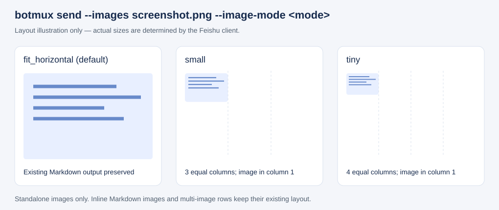

# 发送完整截图的缩小预览

```sh
botmux send --images /tmp/screenshot.png --image-mode small "截图"
botmux send --images /tmp/screenshot.png --image-mode tiny "截图"
```

`--image-mode` 控制独立单图的布局。缩小档位保留完整图片和原始宽高比，仍可点击预览。

| 参数 | 行为 |
| --- | --- |
| 不传 / `fit_horizontal` | 保持现有全宽 Markdown 图片输出 |
| `medium` | 占可用宽度的 1/2，完整显示 |
| `small` | 占可用宽度的 1/3，完整显示 |
| `tiny` | 占可用宽度的 1/4，完整显示 |

这里的 medium/small/tiny 是 **botmux 的分栏宽度档位**，不是飞书 `size` 字段的方形尺寸档位。缩小比例相对卡片可用宽度，窄屏仍按比例收缩，不表示固定像素宽度，也不是原始文件像素的缩放比例。

末尾追加的 `--images` 图片、独占一行的 ``、以及不带 `--images` 而在正文独占一行的 `` 均支持此参数。正文行内图片、并排多图、代码块维持原有行为。非法值或缺值以退出码 2 拒绝。早期 PR 版本的 `large` 和 `crop_center` 已移除，同样报错退出。



以上为布局示意，不是飞书客户端截图。实际客户端视觉效果仍需实测。

实现采用 schema 2.0 原生 `img.scale_type: fit_horizontal`，置于 `column_set` 的 2、3 或 4 个等权分栏中，第一列放图片，其余列为空白；所有列的 `weight` 均为 1；`flex_mode: none` 保持窄屏比例。图片不设置 `size`、`custom_width` 或旧版 `mode`。默认路径和原有多图并排路径保持原样。

依据：[飞书 2.0 图片组件](https://open.feishu.cn/document/feishu-cards/card-json-v2-components/content-components/image) 将 `fit_horizontal` 定义为完整展示、不裁剪，并说明 `size` 仅在裁剪模式下生效；[分栏组件](https://open.feishu.cn/document/feishu-cards/card-json-v2-components/containers/column-set) 支持 `weighted` 宽度与 `none` 窄屏比例压缩。

不使用非等权比例：PR 实际服务端回读发现非等权会被压平为 1:1，而多个等权列能保留。该回读证据来自维护者，当前分支的本地测试验证最终出站 JSON，尚未独立执行真实服务端回读和客户端视觉验收。
